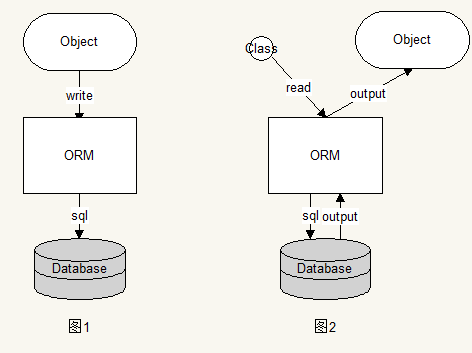
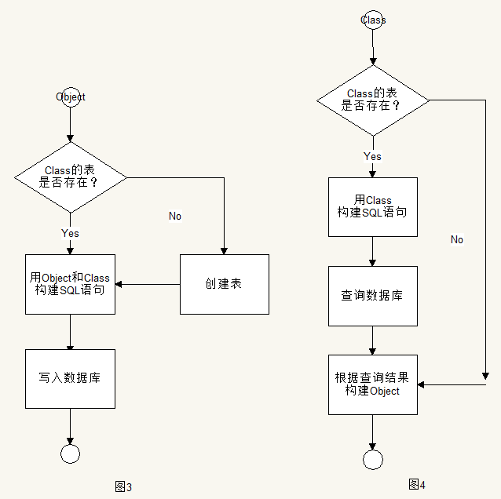

# LazyDB
一款简易使用的orm框架

# 1. 框架设计
## 1.1. 总体流程

> 1. 对于数据库的“增删改”操作，将对象输入，通过ORM框架处理，构建SQL语句，然后写入数据库，如图1所示；
2. 对于查询数据库的操作，输入要输出对象的Class，通过ORM框架处理，构建SQL语句，查询数据库，返回后构建成Object输出，如图2所示；

## 1.2. ORM内部实现流程

> 构建SQL语句的原理：通过Java反射机制，获取Class的字段和Object字段值，通过字符串拼接构建SQL。

## 1.3. Java数据类型与SQLite数据类型映射表
| Java数据类型 | SQLite数据类型 |
| :------------: | :------------: |
| int、Integer、byte、Byte、short、Short、long、Long、Boolean、boolean | INTEGER  |
| float、Float、double、Double | REAL |
| Date | DATE |
| String | TEXT |
> PS：这里简单起见，将所有的字符串都用TEXT；整数都用INTEGER；

# 2. 内部实现的几个重要实现规则
#### 1. 对于SQLite表字段与Java对象字段映射规则：
（1）只映射非`final`和非`static`的Java字段；
（2）Java的字段名即SQLite表的字段名；
（3）主键取Java对象中的名字为ID（不区分大小写）或者加了`@ID`注解的字段，优先查找注解；
#### 2. 保存数据类型规则：
（1）以Java基本数据类型以及其包装类为主，还有`Date`；对于其他类不做处理；
#### 3. 表名称生成规则：
（1）以Java类的完全限定名来命名（`.`替换为`_`），例如：`com.andy.Person`的代表的表名为`com_andy_Person`，保证了表名的唯一性；

# 3. 代码实现
介绍一下几个重要的类
（1） 用于构造SQL语句的类`SQLBuilder`（主要用了Java反射机制）
（2） 用于执行SQL语句的类`SQLiteDBExecutor`
（3） 提供给外部使用的ORM主类`LazyDB`

## 3.1 SQLBuilder：SQL语句构建器
> 该Class的主要作用是，将外部传进来的Object（对象）或者Class（类），通过Java反射机制，构建成SQL语句。

#### 这里以创建表的SQL为例
> 代码步骤分解：
（1）取出Class中所有Field，即Field数组；
（2）遍历Field数组，找出主键的Field，拼到SQL的字符串里；
（3）再次遍历Field数组，过滤掉主键的Field、final、static，拼到SQL的字符串里；

具体代码如下：
```java
	// SQLBuilder类
    /**
     * 构建创建数据库表的sql语句
     *
     * @param clazz 类
     * @return 创建表的sql语句
     */
    public static String buildCreateTableSql(Class<?> clazz) {
        StringBuilder sb = new StringBuilder();

        Field[] fields = ReflectUtil.getDeclaredFields(clazz);
        if (fields == null || fields.length == 0) {
            throw new IllegalStateException("class'fields can not be empty");
        }

        // 开头
        sb.append("create table ")
                .append(TableUtil.getTableName(clazz)) // tableName
                .append("(");
        // 找到主键
        Field idField = IDUtil.getIDField(fields);
        if (idField != null) {
            String idColumn = idField.getName();
            ID id = idField.getAnnotation(ID.class);
            // 判断是有没有注解的
            if (id != null && !"".equals(id.column())) {
                idColumn = id.column();
            }
            DataType dataType = TableUtil.getDataType(idField.getType());
            sb.append(idColumn)
                    .append(" ")
                    .append(dataType.toString())
                    .append(" primary key")
                    .append(",");
        }
        for (Field field : fields) {
            if (Modifier.isStatic(field.getModifiers()) || Modifier.isFinal(field.getModifiers())) {// 移除是final和static的字段
                continue;
            }
            // 让不是id的field进来
            if (field != idField) {
                sb.append(field.getName())
                        .append(" ")
                        .append(TableUtil.getDataType(field.getType()))
                        .append(",");
            }
        }
        // 除去最后一个逗号
        if (sb.charAt(sb.length() - 1) == ',') {
            sb.deleteCharAt(sb.length() - 1);
        }
        sb.append(")");
        String sql = sb.toString();
        // debug log
        DeBugLogger.d("CreateTableSql", sql);
        return sql;
    }
```
**上面代码中用到了几个工具类：**
`ReflectUtil`：用于Java反射的工具类，将所有反射调用的方法都放到这里来，统一管理，方便优化处理；
`IDUtil`：用于主键Field查找的工具类；
`TableUtil`：用于数据库表字段数据与Java数据类型转换、表名生成等；

## 3.2 SQLiteDBExecutor：SQL语句执行器
> 该Class的主要作用是，用于执行SQL语句，或者通过`SQLiteOpenHelper`执行一些数据库操作，反正所有数据库操作都在这里面。

（1）数据库非查询操作
```java
	// SQLiteDBExecutor类
    /**
     * 执行非查询操作事物
     *
     * @param operation 非查询操作
     */
    public void executeTransaction(NoQueryOperation operation) throws Exception {
        SQLiteDatabase db = helper.getWritableDatabase();
        try {
            db.beginTransaction();
            DeBugLogger.d("NoQuery", "beginTransaction");
            if (operation != null) {
                operation.onOperation(db);
            }
            db.setTransactionSuccessful();
            DeBugLogger.d("NoQuery", "transactionSuccessful");
        } finally {
            db.endTransaction();
            DeBugLogger.d("NoQuery", "endTransaction");
        }
    }

    public interface NoQueryOperation {
        void onOperation(SQLiteDatabase db) throws Exception;
    }

    /**
     * 执行SQL，非查询操作
     * @param sql SQL语句
     * @throws Exception
     */
    public void execSQL(final String sql) throws Exception {
        executeTransaction(new NoQueryOperation() {
            @Override
            public void onOperation(SQLiteDatabase db) throws Exception {
                db.execSQL(sql);
            }
        });
    }
```
（2）数据库查询操作
```java
	// SQLiteDBExecutor类
    public Cursor rawQuery(String sql, String[] selectionArgs) {
        SQLiteDatabase db = helper.getReadableDatabase();
        return db.rawQuery(sql, null);
    }
```

然后看一段比较好看的查询代码：
```java
        List<Entity> entities = lazyDB
                .query(Entity.class)
                .selectAll()
                .where("id=? and name=? and age=? and birthday=? and sex=? and money=?",
                        entity.getId(),
                        entity.getName(),
                        entity.getAge() + "",
                        DateUtil.date2String(entity.getBirthday()),
                        entity.isSex() ? "1" : "0",
                        Double.toString(entity.getMoney())
                )
                .findAll();
```
>个人比较钟意这种构建器模式下的代码；看下查询代码，基于Builder模式的实现。

```java
public class SelectBuilder<T> {
    private final SQLiteDBExecutor executor;

    final Class<T> objectClass;
    String[] columns;
    String whereSection;
    String[] whereArgs;

    String having;
    String orderBy;
    String groupBy;
    String limit;

    public SelectBuilder(SQLiteDBExecutor executor, Class<T> clazz) {
        this.objectClass = clazz;
        this.executor = executor;
    }

    public SelectBuilder<T> selectAll() {
        return this;
    }

    public SelectBuilder<T> select(String... columns) {
        this.columns = columns;
        return this;
    }

    public SelectBuilder<T> where(String whereSection, String... whereArgs) {
        this.whereSection = whereSection;
        this.whereArgs = whereArgs;
        return this;
    }

    public SelectBuilder<T> having(String having) {
        this.having = having;
        return this;
    }

    public SelectBuilder<T> orderBy(String orderBy) {
        this.orderBy = orderBy;
        return this;
    }

    public SelectBuilder<T> groupBy(String groupBy) {
        this.groupBy = groupBy;
        return this;
    }

    public SelectBuilder<T> limit(String limit) {
        this.limit = limit;
        return this;
    }
	......
}
```
> 提供了类似写SQL查询语句的字符串构建器；
最后，执行查询；

```java
public class SelectBuilder<T> {
    ......

    /**
     * 执行查询操作，获取查询结果集
     *
     * @return 数据库游标 Cursor
     */
    public Cursor executeNative() {
        // 查询表是否存在
        String sql = SQLBuilder.buildQueryTableIsExistSql(objectClass);
        Cursor cursor = executor.rawQuery(sql, null);
        if (cursor != null) {
            try {
                if (cursor.moveToNext()) {
                    if (cursor.getInt(0) == 0) {
                        return null;
                    }
                }
            } finally {
                cursor.close();
            }
        } else {
            return null;
        }

        //String sql = SqlBuilder.buildQuerySql(TableUtil.getTableName(objectClass), columns, whereSection, whereArgs, groupBy, having, orderBy, limit);
        //Cursor cursor = db.rawQuery(sql, null);
        // 执行查询
        return executor.query(this);
    }

    /**
     * 执行查询操作，获取查询结果集
     *
     * @return 查询结果集，空集则查询不到
     * @throws InstantiationException
     * @throws IllegalAccessException
     * @throws NoSuchFieldException
     * @throws ParseException
     */
    public List<T> findAll() throws InstantiationException, IllegalAccessException, NoSuchFieldException, ParseException {
        List<T> results = new ArrayList<>();

        // 执行查询
        Cursor cursor = executeNative();
        if (cursor != null) {
            try {
                while (cursor.moveToNext()) {
                    T object = ObjectUtil.buildObject(objectClass, cursor);
                    results.add(object);
                }
            } finally {
                cursor.close();
            }
        }
        return results;
    }

    /**
     * 执行查询操作，获取查询结果集的第一个
     *
     * @return 查询结果集的第一个，null则查询不到
     * @throws InstantiationException
     * @throws IllegalAccessException
     * @throws NoSuchFieldException
     * @throws ParseException
     */
    public T findFirst() throws InstantiationException, IllegalAccessException, NoSuchFieldException, ParseException {
        T result = null;

        // 执行查询
        Cursor cursor = executeNative();
        if (cursor != null) {
            try {
                if (cursor.moveToNext()) {
                    result = ObjectUtil.buildObject(objectClass, cursor);
                }
            } finally {
                cursor.close();
            }
        }
        return result;
    }
}
```
> PS：ObjectUtil用于通过Java反射实例化对象，然后对对象进行赋值；

## 3.3 LazyDB：ORM入口的主类

```java
public final class LazyDB {
    /**
     * 阻止通过new来实例化LazyDB
     * 应该使用create方法来创建LazyDB
     */
    private LazyDB() {
    }

    private SQLiteDBExecutor executor;

    /**
     * 创建默认配置的数据库
     *
     * @param context 上下文
     */
    public static LazyDB create(Context context)  {}

 ......

    /**
     * 创建表
     *
     * @param clazz 类
     */
    public void createTable(Class<?> clazz) throws Exception  {}

    /**
     * 创建表
     *
     * @param tableName       表名
     * @param idColumn        id
     * @param idDataType      id的类型
     * @param isAutoIncrement 是否自动增长
     * @param columns         其他列名，不包括id
     */
    public void createTable(String tableName, String idColumn, String idDataType, boolean isAutoIncrement, String... columns) throws Exception  {}

    /**
     * 删除表
     *
     * @param clazz 类
     */
    public void dropTable(final Class<?> clazz) throws Exception  {}

    /**
     * 删除数据库中所有的表
     */
    public void dropAllTables() throws Exception  {}

    /**
     * 查询所有表名
     *
     * @return 所有表名的集合；若没有表，则是空集合
     */
    public List<String> queryAllTableNames()  {}

    /**
     * 从表中查找出所有字段名
     *
     * @param clazz class
     * @return 字段列表
     * @throws NoSuchFieldException
     * @throws InstantiationException
     * @throws ParseException
     * @throws IllegalAccessException
     */
    public List<ColumnInfo> queryAllColumnsFromTable(Class<?> clazz) throws NoSuchFieldException, InstantiationException, ParseException, IllegalAccessException {}

    /**
     * 表是否存在
     *
     * @param clazz 类
     * @return true 表存在，false 表不存在
     */
    public boolean isTableExist(Class<?> clazz)  {}

    /**
     * 判断对象是否存在数据库中
     *
     * @param object 对象
     * @return true 存在，false 不存在
     * @throws IllegalAccessException
     */
    public boolean isObjectExist(Object object) throws IllegalAccessException  {}

    /**
     * 插入对象
     *
     * @param object 对象
     */
    public void insert(@NonNull Object object) throws Exception  {}

    /**
     * 插入多个对象数据
     *
     * @param objectList 对象集合
     * @throws IllegalAccessException
     */
    public void insert(@NonNull final List objectList) throws Exception  {}

    /**
     * 更新对象
     *
     * @param object 对象
     * @throws IllegalAccessException
     */
    public void update(@NonNull final Object object) throws Exception {}

    /**
     * 插入或更新对象
     *
     * @param object 对象
     * @throws IllegalAccessException
     */
    public void insertOrUpdate(@NonNull Object object) throws Exception  {}

    /**
     * 删除对象
     *
     * @param object 对象
     * @throws IllegalAccessException
     */
    public void delete(@NonNull final Object object) throws Exception  {}

    /**
     * 删除多个object集合
     *
     * @param objectList object集合
     * @throws IllegalAccessException
     */
    public void delete(@NonNull final List objectList) throws Exception  {}

    /**
     * 删除数据
     *
     * @param clazz       类
     * @param whereClause 例如：id=?
     * @param whereArgs   ?的值
     */
    public void delete(final Class<?> clazz, final String whereClause, final String[] whereArgs) throws Exception  {}

    /**
     * 执行查询操作
     *
     * @param clazz 类
     * @return select操作的构建器
     */
    public <T> SelectBuilder<T> query(Class<T> clazz)  {}

    /**
     * 通过id查询
     *
     * @param clazz   类
     * @param idValue idValue
     * @return object
     * @throws NoSuchFieldException
     * @throws InstantiationException
     * @throws ParseException
     * @throws IllegalAccessException
     */
    public <T> T queryById(Class<T> clazz, Object idValue) throws Exception {}
```

## 4. Java反射优化方案
Java反射机制虽然好用，但是为此会牺牲性能，这里有个优化点，可以在取反射时，加一层内存缓存，先查缓存，找不到再取反射。
